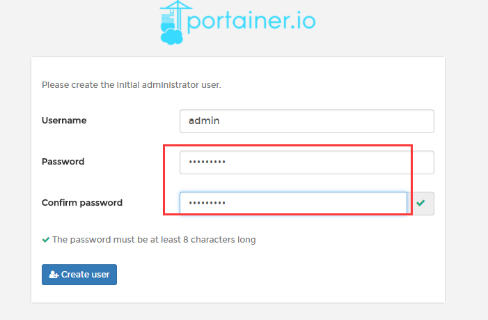
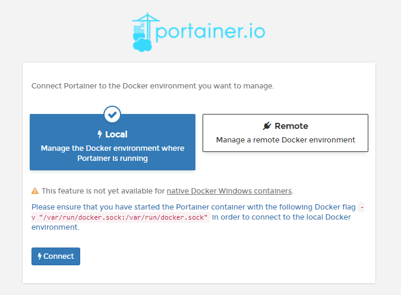
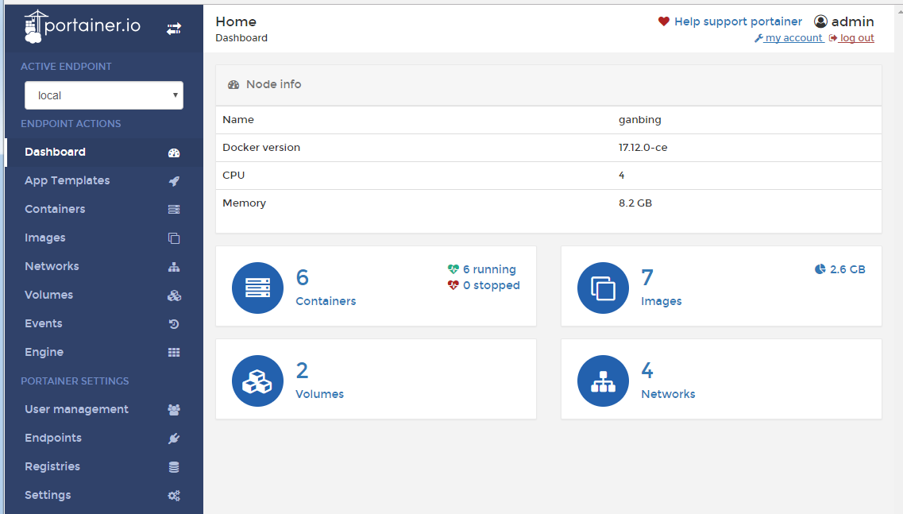
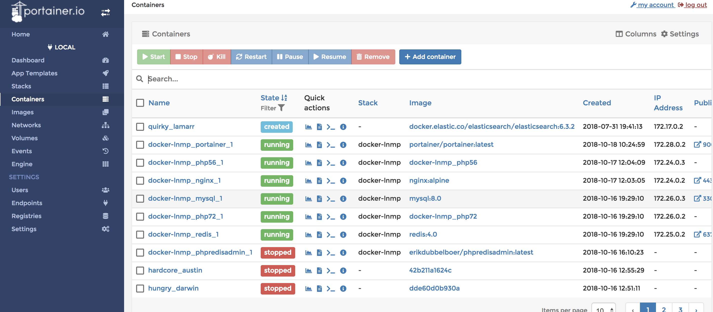

## 简介
基于Docker-LNMP的一键开发环境安装。便于前后端快速部署环境，更加专注业务功能开发，减少环境配置带来的困扰。

## 特性
1. 支持**多版本PHP**共存，可任意切换（PHP5.6、PHP7.2)
2. 集中管理Nginx,PHP、Mysql、Redis配置文件
3. 集中管理容器Hosts文件
4. 集中管理Nginx,PHP、Mysql日志文件
5. 优化Nginx配置参数管理
6. 默认安装了Phalcon,Swoole,Redis,Xdebug项目依赖扩展
7. 支持**HTTPS和HTTP/2**
8. Docker容器可视化管理
9. 支持扩展自定义

## 项目结构
```
├── Dockerfile-php                          #PHP镜像构建文件
├── Dockerfile-redis                        #Redis镜像构建文件
├── conf                                    #默认服务配置文件
│   ├── hosts                               #Host配置，同步到PHP和Nginx容器
│   ├── mysql.conf                          #mysql配置
│   ├── nginx                               #Nginx相关配置
│   │   ├── nginx.conf                      #Nginx默认配置文件
│   │   ├── phalcon-admin-rewrite.conf      #Phalcon后台项目路由重写规则
│   │   ├── phalcon-admin.conf              #Phalcon后台项目规则
│   │   ├── phalcon-rewrite.conf            #Phalcon接口项目路由重写规则
│   │   ├── phalcon.conf                    #Phalcon接口项目规则
│   │   ├── php-fpm.conf                    #PHP-FPM参数配置
│   │   └── vhost                           #Nginx虚拟机配置
│   ├── php                                 #PHP相关配置
│   │   ├── php-fpm-56.conf                 #PHP-FPM配置文件
│   │   ├── php-fpm-72.conf                  
│   │   ├── php-56.ini                      #php.ini配置
│   │   └── php-72.ini                               
│   └── redis.conf                          #Redis默认配置文件
├── conf_use                                #开发人员本地服务配置副本
├── copy_conf                               #服务配置拷贝脚本
├── doc                                     #项目文档
├── data                                    #服务数据目录
│   ├── mysql
│   └── redis
├── docker-compose.yml                      #后端docker-compose启动配置
├── docker-compose-f.yml                    #前端docker-compose启动配置
├── exts                                    #PHP扩展包
│   ├── install.sh                          #PHP扩展安装脚本
├── log                                     #日志目录
├── sources                                 #Debian源目录
└── www                                     #项目代码目录
    └── localhost
```

## 快速使用
1. 本地需要安装`docker`和`docker-compose`，教程参考[官方文档](http://https://docs.docker.com/engine/installation/)。
2. 启动

    ```
    $ cd docker-lnmp
    # 本地使用conf副本，根据自身情况修改conf_use目录配置，不会提交到Git
    $ chmod +x copy_conf
    $ ./copy_conf
    # 后端开发使用该配置，启动，前端使用docker-compose -f docker-compose-f.yml up启动
    $ docker-compose up
    ```
3. 然后在浏览器中访问[http://localhost](http://localhost)

## 切换PHP版本
1. 确认`docker-compose.yml`配置中已经将PHP`php56`,`php72`已经开启
2. 修改`conf_use/nginx/php-fpm.conf`中`fastcgi_pass`参数

例如，示例的localhost用的是PHP7.2

```
fastcgi_pass  php72:9000;
```

要改用PHP5.6，修改为：

```
fastcgi_pass  php56:9000;
```

再重启Nginx

```
docker exec -it docker-lnmp_nginx_1 nginx -s reload
```

## 新建站点
1. 在`conf_use/nginx/vhost`目录下添加你的站点配置
例如：

```
server {
    listen       80;
    server_name  localhost;
    root   /var/www/localhost;
    index  index.php index.html index.htm;
    
    access_log  /var/log/lnmp/nginx.localhost.access.log  main;
    error_log  /var/log/lnmp/nginx.localhost.error.log  warn;
    
    # 基于phalcon框架的API服务，引用该配置
    #include /etc/nginx/phalcon.conf;

    # 基于phalcon框架的后台系统服务，引用该配置
    #include /etc/nginx/phalcon-admin.conf;

    #其他框架配置，自定义路由rewrite规则，引入php-fpm
    rewrite ^.*$ /index.php last;
    include /etc/nginx/php-fpm.conf;

}
```

2. 修改`conf_use/hosts`文件，添加域名IP解析

```
127.0.0.1 localhost
```

3. 重启Nginx

```
    docker exec -it docker-lnmp_nginx_1 nginx -s reload
```


## 添加快捷键
在开发的时候，我们可能经常使用docker exec -it切换到容器中或者重启Nginx，把常用的做成命令别名是个省事的方法。

Mac电脑打开~/.bash_profile,在最后添加一下命令别名

    alias drnginx='docker exec -it docker-lnmp_nginx_1 nginx -s reload'
    alias dcnginx='docker exec -it docker-lnmp_nginx_1 /bin/sh'
    alias dcphp72='docker exec -it docker-lnmp_php72_1 /bin/bash'
    alias dcphp56='docker exec -it docker-lnmp_php56_1 /bin/bash'
    alias dcmysql='docker exec -it docker-lnmp_mysql_1 /bin/bash'
    alias dcredis='docker exec -it docker-lnmp_redis_1 /bin/bash'

在执行以下命令
    
    ~$ source ~/.bash_profile
    ~$ dcphp56
    root@7da24dca11c5:/var/www/html#

## Portainer使用
Portainer是一个开源、轻量级Docker管理用户界面，基于Docker API，提供状态显示面板、应用模板快速部署、容器镜像网络数据卷的基本操作（包括上传下载镜像，创建容器等操作）、事件日志显示、容器控制台操作、Swarm集群和服务等集中管理和操作、登录用户管理和控制等功能。功能十分全面，基本能满足中小型单位对容器管理的全部需求。

1. 设置账号密码，访问[http://localhost:9001](http://localhost:9001),端口在docker-compose文件修改

2. 单机版本选择“Local"，点击Connect即可连接到本地docker，如下图

注意：从上图可以看出，有提示需要挂载本地 /var/run/docker.socker与容器内的/var/run/docker.socker连接。因此，在启动时必须指定该挂载文件
3. 进入后可以对容器、镜像、网络、数据卷等进行管理，如下图：

4. 点击`Containes`可以管理所有容器


## 其他问题
#### 1、PHP-FPM重启通过重启容器来实现

    docker restart {容器ID}

#### 2、PHP安装新的扩展
扩展有两种方式安装：源码编译和PECL安装

1. 通过PECL安装
例如安装`memcached`扩展，在`Dockerfile-php`配置安装扩展命令后面加下如下参数

```
&& pecl install memcached-2.2.0 \
&& docker-php-ext-enable memcached
```

2. 通过源码编译安装

例如安装`redis`扩展，下载源码放置在`exts`目录，添加编译命令到`install.sh`文件

```
cd /tmp/exts \
&& mkdir redis \
&& tar -xf redis-4.1.1.tgz -C redis --strip-components=1 \
&& ( cd redis && phpize && ./configure && make && make install ) \
&& docker-php-ext-enable redis
```
3. 重新构建镜像

```
docker-compose build 
```

#### 3、Nginx容器如何批量映射端口号

```
ports:
  - "8200-9000:8200-9000"
```

端口设置[官方文档](https://docs.docker.com/compose/compose-file/#ports)

#### 4、配置Docker加速器
为了永久性保留更改，修改`/etc/docker/daemon.json`文件并添加上`registry-mirrors`键值。

    {
      "registry-mirrors": ["https://registry.docker-cn.com"]
    }

其他的加速器：阿里云加速器、腾讯云加速器 

#### 5、PHP项目更新Composer依赖
如果本地宿主机没有安装PHP以及Composer，可以通过进入PHP容器进行Composer依赖更新。
